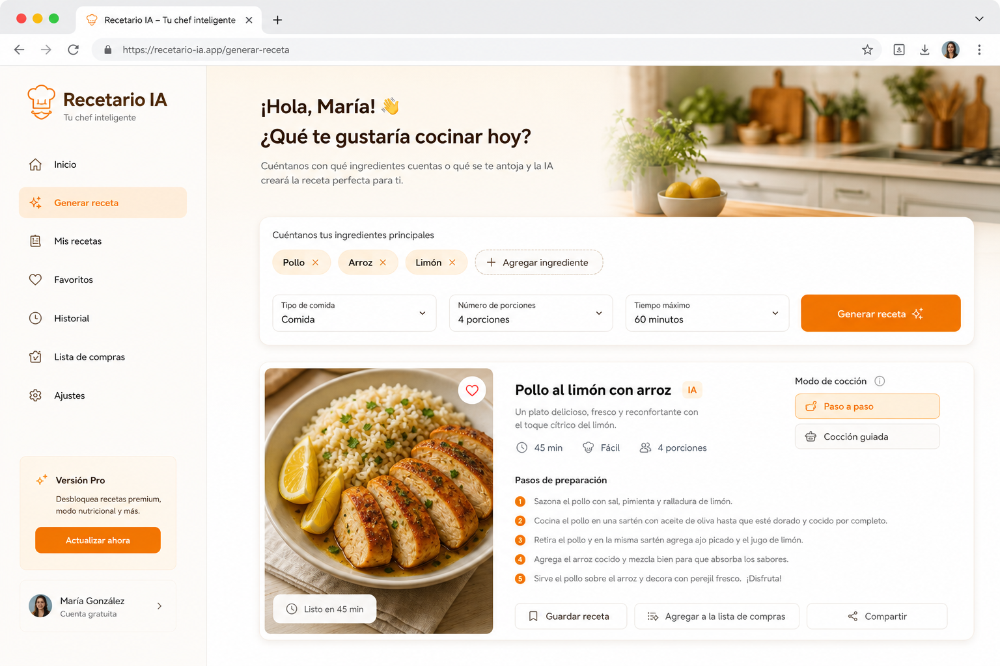

<div align="center">

# Recetario IA

### De lo que tienes en la nevera a una receta lista para cocinar — en segundos.

[](https://astro.build)
[](https://deepmind.google/technologies/gemini/)
[](https://appwrite.io)
[](https://svelte.dev)
[](https://www.typescriptlang.org)
[](https://vercel.com)

**[Ver demo en vivo](https://recetario.moisesvalero.es)** · [Recetas de ejemplo](https://recetario.moisesvalero.es/recetas) · [Reportar issue](https://github.com/moisesvalero/recetario-ia/issues)



> La captura se genera desde la app con Playwright (`pnpm run screenshot`). No es un mockup de IA.

</div>

---

## El problema

Abres ChatGPT, escribes _"tengo pollo y arroz"_, y recibes un párrafo largo. Sin pasos claros, sin tiempos, sin modo cocina. Cierras el chat y vuelves a pedir delivery.

## La solución

**Recetario IA** convierte tus ingredientes en una **ficha de cocina estructurada**: cantidades, pasos, tiempos, tips y un **modo cocinar** paso a paso con temporizadores. Todo en una interfaz rápida, pensada para la cocina real.

---

## Características

| | |
|---|---|
| **Generador inteligente** | Añade ingredientes como chips, define tiempo, porciones, dieta y dificultad |
| **Recetas estructuradas** | JSON validado con Zod → UI clara, no texto suelto |
| **Modo cocinar** | Navegación paso a paso con temporizadores integrados |
| **Persistencia Híbrida** | Cuentas gratis con **Appwrite Cloud** (sincronizada) y fallback automático a **localStorage** si no se configuran keys |
| **PDF Bonito** | Descarga e imprime tus recetas favoritas maquetadas en A4 para los usuarios registrados |
| **Catálogo estático** | Recetas de ejemplo con Content Collections de Astro |
| **Rendimiento** | Astro + islas Svelte 5: carga mínima en cliente |

---

## Stack técnico

```
Astro 7          → SSR, Content Collections (Sätteri), rutas híbridas
Svelte 5         → Islas interactivas (generador, modo cocinar, auth, lista de compras)
Tailwind CSS 4   → UI responsive mobile-first con diseño premium
Vercel AI SDK    → generateObject + schema Zod
Google Gemini    → gemini-2.0-flash (principal) + OpenRouter (fallback a openrouter/free)
Appwrite Cloud   → Autenticación, base de datos y preferencias de usuario en la nube
Vercel           → Deploy serverless
```

---

## Inicio rápido

### Requisitos

- Node.js ≥ 22.12
- pnpm
- Clave de Google Generative AI (Gemini) o de OpenRouter
- Proyecto de Appwrite Cloud (opcional, para persistencia en la nube)

### Instalación

```bash
git clone https://github.com/moisesvalero/recetario-ia.git
cd recetario-ia
cp .env.example .env
# Edita .env y añade tus claves de API
pnpm install
pnpm dev
```

Abre [http://localhost:4321](http://localhost:4321).

### Scripts

| Comando | Descripción |
|---------|-------------|
| `pnpm dev` | Servidor de desarrollo |
| `pnpm build` | Build de producción |
| `pnpm preview` | Previsualizar build |
| `pnpm check` | astro check + tsc |
| `pnpm lint` | oxlint |
| `pnpm test` | Vitest |
| `pnpm format` | Prettier formateado completo |

---

## Variables de entorno

| Variable | Contexto | Descripción |
|----------|----------|-------------|
| `GOOGLE_GENERATIVE_AI_API_KEY` | Servidor | Clave de Google AI para el LLM principal |
| `OPENROUTER_API_KEY` | Servidor | Clave de OpenRouter para el LLM fallback |
| `PUBLIC_APPWRITE_ENDPOINT` | Cliente | Endpoint de la API de Appwrite Cloud (`https://cloud.appwrite.io/v1`) |
| `PUBLIC_APPWRITE_PROJECT_ID` | Cliente | ID del proyecto en Appwrite Cloud |
| `PUBLIC_APPWRITE_DATABASE_ID` | Cliente | ID de la base de datos en Appwrite |
| `PUBLIC_APPWRITE_COLLECTION_RECETAS` | Cliente | ID de la tabla/colección para recetas guardadas |

---

## Arquitectura

```mermaid
flowchart LR
  User[Usuario] --> UI[Isla Svelte]
  UI -->|POST /api/generate-recipe| API[Endpoint Astro]
  API --> Gemini[gemini-2.0-flash]
  Gemini -->|Fallback| OpenRouter[openrouter/free]
  API --> UI
  UI --> Persist[Appwrite Cloud / localStorage]
  Static[Content Collections] --> Pages[/recetas]
```

---

## Por qué no es otro ChatGPT

- **Formulario guiado** con restricciones reales (tiempo, dieta, porciones)
- **Salida tipada** con Zod — siempre la misma estructura
- **Modo cocinar** con timers — pensado para tener el móvil en la encimera
- **Cuentas gratis** para guardar favoritos, compras y descargar PDF
- **Recetas estáticas** indexables para SEO

---

## Licencia

MIT — úsalo, modifícalo, despliégalo.

---

<div align="center">

Hecho con **Astro 7** y mucha hambre.

[⭐ Star en GitHub](https://github.com/moisesvalero/recetario-ia) si te salva la cena.

</div>
